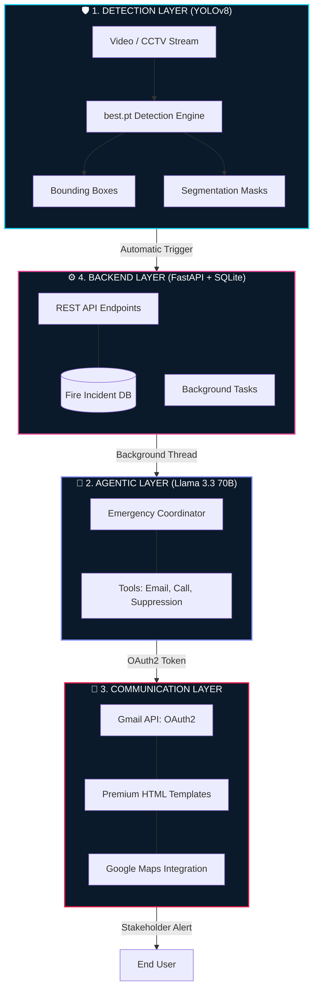

# FireWatch AI: Autonomous Fire & Smoke Incident Management System

[](https://fastapi.tiangolo.com/)
[](https://reactjs.org/)
[](https://ultralytics.com/)
[](https://groq.com/)
[](https://developers.google.com/gmail/api)

FireWatch AI is a production-grade, high-fidelity monitoring ecosystem designed for autonomous fire and smoke detection. It integrates state-of-the-art computer vision (YOLOv8) with a sophisticated **Agentic Emergency Coordinator** and a high-end Cyber HUD dashboard.


---

## 🚀 System Capabilities

### 1. Agentic Emergency Coordination (Autonomous)
The system features a **Fire Management Agent** powered by Llama 3.3 (via Groq) that acts as an "AI Safety Officer." When a fire is detected:
- **Reasoning Loop**: The AI analyzes detection area, coordinates, and zone safety protocols.
- **Gmail API Integration**: Dispatches **Premium HTML Alerts** with SOC-style dashboard layouts.
- **Dynamic Maps**: Automatically embeds Google Maps links for rapid responder navigation.
- **Voice Escalation**: Generates urgent, natural-sounding scripts for emergency calls (Simulated).
- **Suppression Control**: Autonomously decides and logs the activation of Water, CO2, or Foam systems.

### 2. Cyber HUD Visual Overlay
A sophisticated, canvas-based particle engine that transforms raw video feeds into actionable intelligence:
- **Heat-Mapped Detections**: Dynamic color scaling based on thermal intensity.
- **Tactical Data Labels**: Floating HUD elements showing class, confidence, and pixel-area.
- **Particle Physics**: Real-time glowing embers and spark effects for high-impact visualization.

### 3. Agentic RAG Assistant
Integrated **Retrieval-Augmented Generation (RAG)** system built on FAISS:
- Constrained knowledge base focused on NFPA (101, 13) and OSHA safety standards.
- Context-aware responses that prioritize lives and critical infrastructure.

### 4. Operations Dashboard
A premium, glassmorphism-inspired UI featuring:
- **Live Status Monitors**: Real-time health checks for backend and sensors.
- **Detection Timeline**: Historic trend analysis and incident logging.

---

## 🏗️ Technical Architecture



---

## 🛠️ Setup & Configuration

### 1) Prerequisites
- Python 3.10+
- Node.js 18+
- Google Cloud Console Project (with Gmail API enabled)
- Groq API Key

### 2) Environment Setup (`.env`)
Create a `.env` in the root directory:
```env
# AI & Core
GROQ_API_KEY=your_key_here
FIRE_DETECT_MODEL=./models/best.pt

# Emergency Alerts
REMINDER_EMAIL_SENDER=your_gmail@gmail.com
REMINDER_EMAIL_RECEIVERS=stakeholder1@email.com,stakeholder2@email.com
```

### 3) Gmail API Authentication
1. Download your `credentials.json` from the Google Cloud Console.
2. Place it in the root directory.
3. Run `python fire_agent.py` once to trigger the OAuth2 flow and generate `token.json`.

### 4) Installation
```bash
# Backend
python3 -m venv .venv && source .venv/bin/activate
pip install -r requirements.txt
python fire_backend.py

# Frontend
cd frontend && npm install && npm run dev
```

---

## 📂 Project Structure

- `fire_backend.py`: Core FastAPI Server with background task orchestration.
- `fire_agent.py`: Agentic reasoning loop, Gmail HTML builder, and tool definitions.
- `real_rag_system.py`: Vector search engine for safety protocols.
- `test_emergency.py`: End-to-end validation script for the alert pipeline.

---

## 👤 Credits

<div align="center">
  <p>Designed and Developed with precision by</p>
  <h3><strong>Muhammad Umar Farooq</strong></h3>
  <a href="https://omerfarooq223.github.io">
    
  </a>
  <br/><br/>
  <i>"Building the future of autonomous safety systems."</i>
</div>
