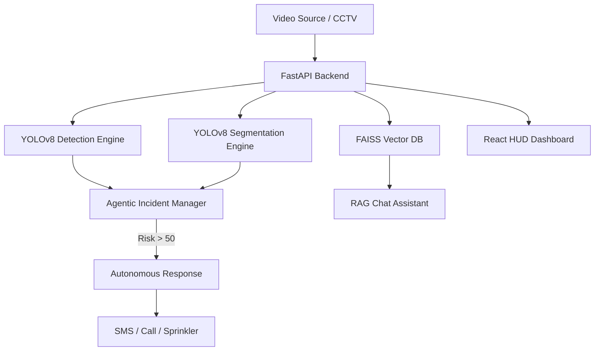

# FireWatch AI: Autonomous Fire & Smoke Incident Management System

[](https://fastapi.tiangolo.com/)
[](https://reactjs.org/)
[](https://ultralytics.com/)
[](https://www.sqlite.org/)

FireWatch AI is a production-grade, high-fidelity monitoring ecosystem designed for autonomous fire and smoke detection. It integrates state-of-the-art computer vision (YOLOv8) with an agentic incident response loop and a high-end Cyber HUD dashboard.


---


## 🚀 System Capabilities

### 1. Autonomous Incident Response (Zero-Latency)
The system is equipped with an **Agentic Decision Engine** that monitors risk levels in real-time. When detection confidence or area thresholds are breached (>50% Risk Score), the system automatically:
- **Dispatches Email Alerts**: Notifies facility managers with detection metadata.
- **Initiates Emergency Calls**: Escalates to 911 services (Simulated logic).
- **Activates Suppression Systems**: Triggers zone-specific sprinklers (Water, CO2, or Foam) based on the environment (e.g., Server Room vs. Warehouse).

### 2. Cyber HUD Visual Overlay
A sophisticated, canvas-based particle engine that transforms raw video feeds into actionable intelligence:
- **Heat-Mapped Detections**: Dynamic color scaling (Blue → Yellow → Red) based on thermal intensity.
- **Particle Physics**: Real-time glowing embers and fire-spark effects for high-impact visualization.
- **Tactical Data Labels**: Floating HUD elements showing class name, confidence scores, and pixel-area measurements.
- **Scanline Effects**: Animated "Cyber HUD" scanlines and corner brackets for a military-grade monitoring feel.

### 3. Agentic RAG Assistant
Integrated **Retrieval-Augmented Generation (RAG)** system built on LangChain and FAISS. 
- Constrained knowledge base focused on fire safety protocols, evacuation procedures, and OSHA standards.
- Context-aware responses that prioritize safety over generic AI behavior.

### 4. Operations Dashboard
A premium, glassmorphism-inspired UI featuring:
- **Live Status Monitors**: Real-time health checks for backend and sensor feeds.
- **Detection Timeline**: Historic trend analysis using Recharts.
- **Compact Video Controls**: Streamlined workflow for uploading, detecting, and exporting results.

---

## 🏗️ Technical Architecture



---

## 🛠️ Tech Stack

- **Computer Vision**: Ultralytics YOLOv8 (Segmentation & Detection), OpenCV
- **Backend**: FastAPI, SQLAlchemy (SQLite), Pydantic
- **AI/LLM**: SentenceTransformers (Embeddings), FAISS (Vector Store), GPT-based Knowledge Retrieval
- **Frontend**: React 18, Vite, Lucide-React, Recharts
- **Styling**: Custom CSS3 (Glassmorphism, Particle Engine, Keyframe Animations)

---

## 📂 Project Structure

```text
.
├── fire_backend.py        # Core FastAPI Server & CV Logic
├── fire_agent.py          # Autonomous Decision Logic & Incident Handling
├── real_rag_system.py     # Vector Database & Retrieval Engine
├── models/                # YOLO Weights & Segmentation Modules
├── tests/                 # System Validation Scripts
├── frontend/              # React Application
│   ├── src/
│   │   ├── App.jsx           # Dashboard Hub
│   │   ├── overlay-enhanced.js # Cyber HUD Particle Engine
│   │   └── index.css         # HUD Design System
│   └── package.json
└── .env.example           # Environment Template
```

---

## ⚡ Quick Start

### 1) Backend Environment
```bash
# Create Virtual Environment
python3 -m venv .venv
source .venv/bin/activate

# Install Dependencies
pip install -r requirements.txt

# Start the CV/FastAPI engine
python fire_backend.py
```
*Base URL: `http://localhost:8000` | Docs: `/docs`*

### 2) Frontend Environment
```bash
# Navigate and launch dashboard
cd frontend
npm install
npm run dev
```
### 3. Environment Configuration
Create a `.env` file in the root directory based on `.env.example`:
```env
FIRE_DETECT_MODEL=./best.pt
BACKEND_URL=http://localhost:8000
GROQ_API_KEY=your_groq_api_key
```

### 4. Model Weights (best.pt)
The core detection model (`best.pt`) is ~260MB and is excluded from the standard git repository. 
- **Download**: [Insert your download link here]
- **Placement**: Ensure `best.pt` is placed in the project root before starting the backend.

---

## 📋 Operational Procedures

1. **Dashboard Initialization**: Ensure the top-right status chip shows **ONLINE**.
2. **Video Analysis**: Upload any MP4/AVI file. The system will auto-hide the upload panel to maximize the Cyber HUD viewport.
3. **Emergency Override**: Manual trigger buttons are available in the "Incident Response" panel for human-in-the-loop control.
4. **Export**: Processed videos with the Cyber HUD burned-in can be exported via the "Export" button in the compact controller.

---

## 👤 Credits

Designed and Developed with precision by **Muhammad Umar Farooq**.  
*Building the future of autonomous safety systems.*
